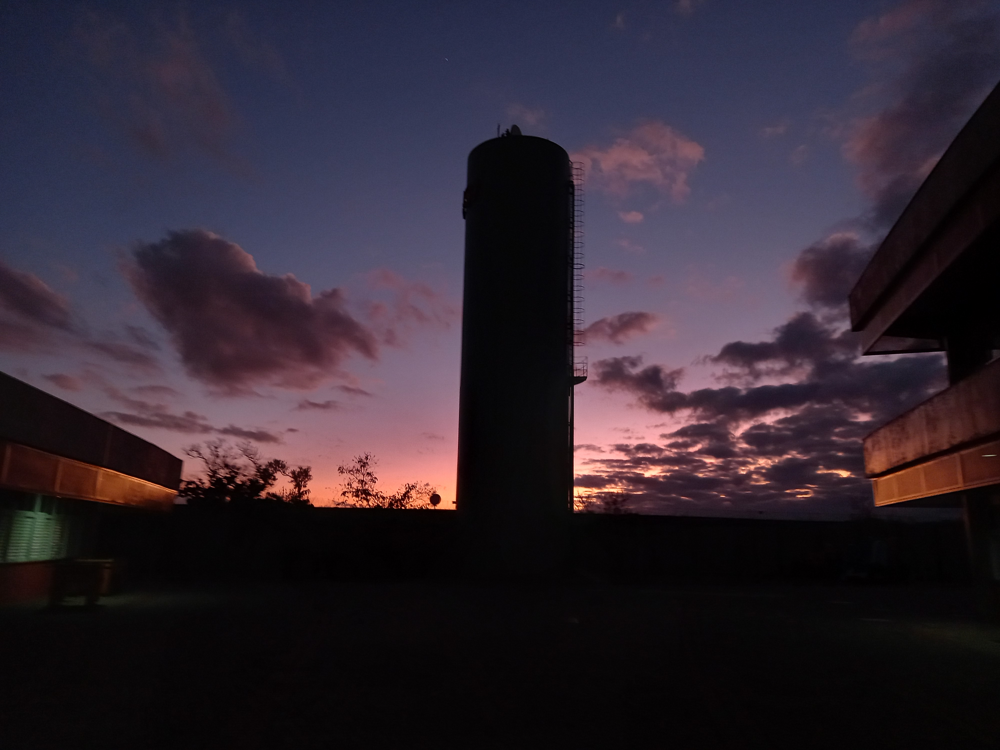

  

<h1 align="center">Projeto Caixa d'água Inteligente</h1>

Monitorador do volume da caixa d'agua da escola SESI 165 Centro Educacional

## Introdução
No SESI 165, possuímos uma enorme caixa d'água, que embora não apresente problema aos alunos, traz diversas complicações aos funcionários.

Em uma reunião que realizamos com Felipe Barbosa, Supervisor de Manutenção do SESI, foi nos apontado um grande risco que esta caixa d'água sofria. De 2 a 3 vezes por semana, um profissional tinha que subir até o topo para visualizar qual era o nível de água ali disponível, para que, caso fosse necessário, contrata-se um caminhão pipa para abastecer a unidade. Além dos diversos problemas de segurança e físico aos profissionais envolvidos, identificamos durante essa reunião uma oportunidade para automatizar esse processo repetitivo

Com a ideia em mente, começamos as estruturar o projeto

## Testes
O primeiro testes que realizamos foi feito em um pequeno pote, para termos uma noção inicial dos cálculos que deveriam ser feitos para analisar o volume de água na caixa d'água. Esse primeiro teste foi bem-sucedido, conseguimos as equações que deveríamos utilizar:

- Para calcular o volume do recipiente: $V=\pi * r ^ 2 * h$

- Para calcular o volume de água: $V=\pi * r ^ 2 * (d - h)$

- Para a porcentagem de água: $P={100*(d-h) \over h}$

## Componentes
| Quantidade | Nome do Componente | Função                                                                     |
|------------|--------------------|----------------------------------------------------------------------------|
| 1          | NodeMCU ESP8266    | Placa de desenvolvimento de soluções para IoT - Permite a comunicação WiFi |
| 1          | JSN-SR04T          | Sensor ultrassônico a prova d'água                                         |

## Autor

| [ @edsonpetrinijr](https://github.com/edsonpetrinijr) |
| :---: |
